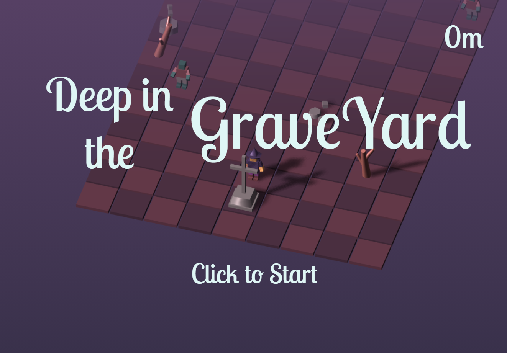
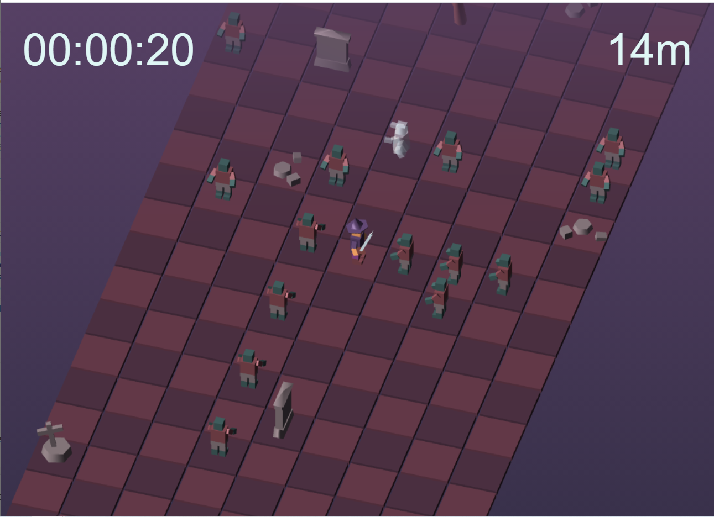
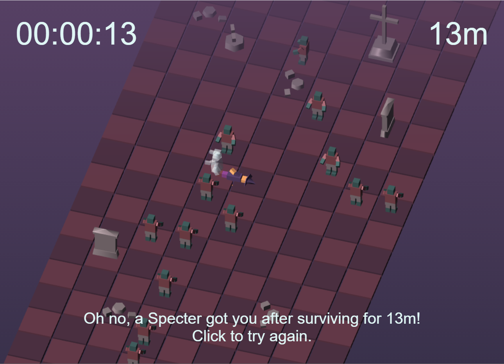

# LD48 - Deep in the Graveyard
Endless Roguelite for Ludum Dare 48 Compo.
This is my most poorly written codebase ever. I started late and only got less than 24 hours to work on this.

## Intro
You are deep in a zombie-infestation graveyard. How deep can you go before getting swarmed by zombies?

## Tools
Written in Typescript. three.js for 3D rendering. All 3D models are procedurally generated using three.js. [Zughy 32](https://lospec.com/palette-list/zughy-32) palette. Sound effects generated by jsfxr. Background music generated by Wolfram Tones. [Lobster Two](https://fonts.google.com/specimen/Lobster+Two) font from Google Fonts.

## Screenshots

